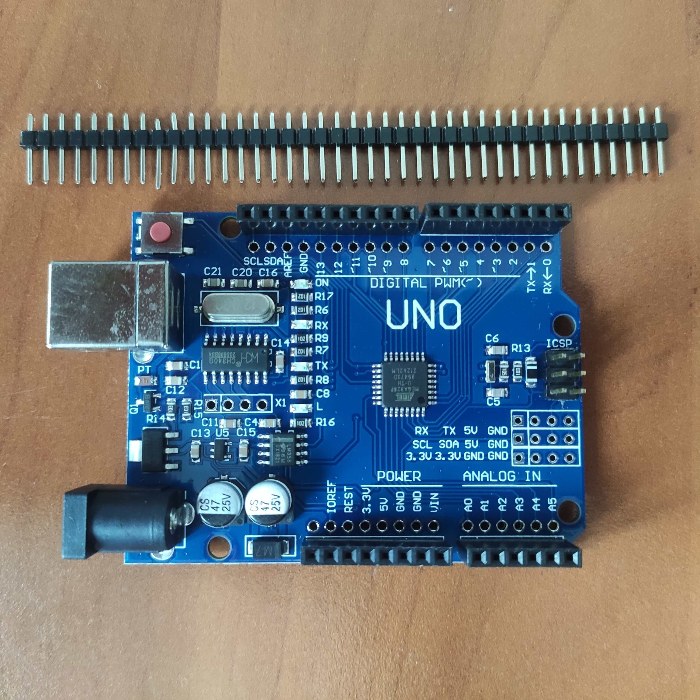
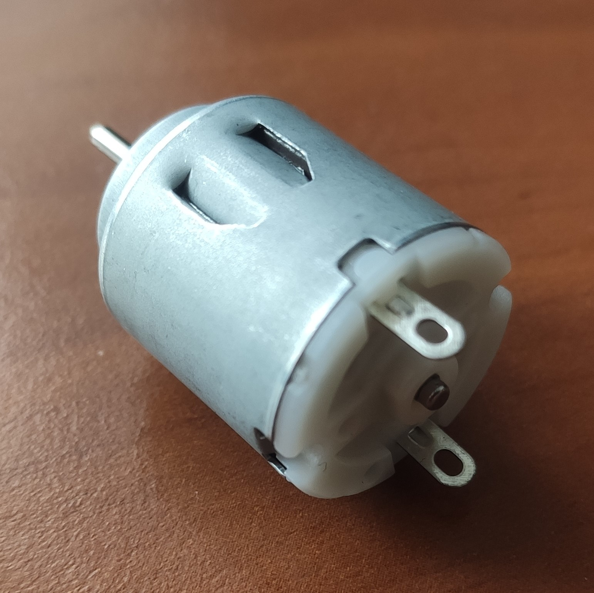
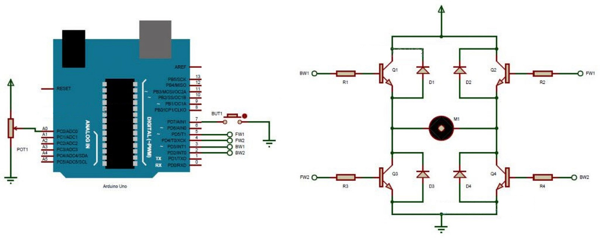
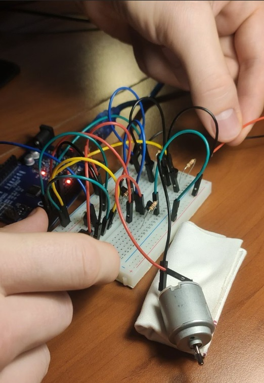
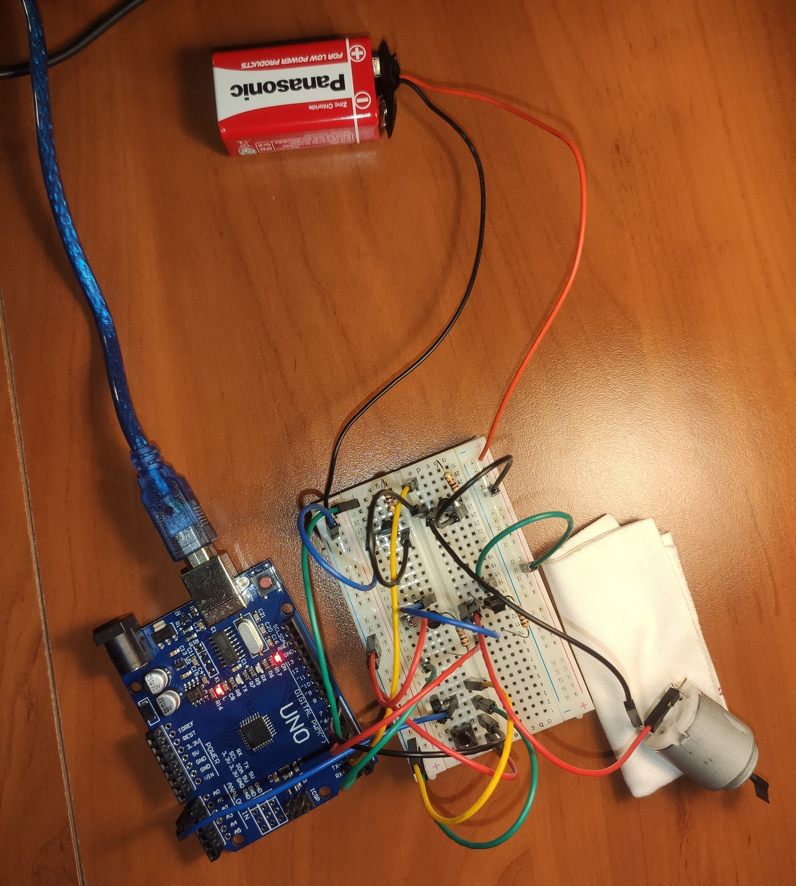
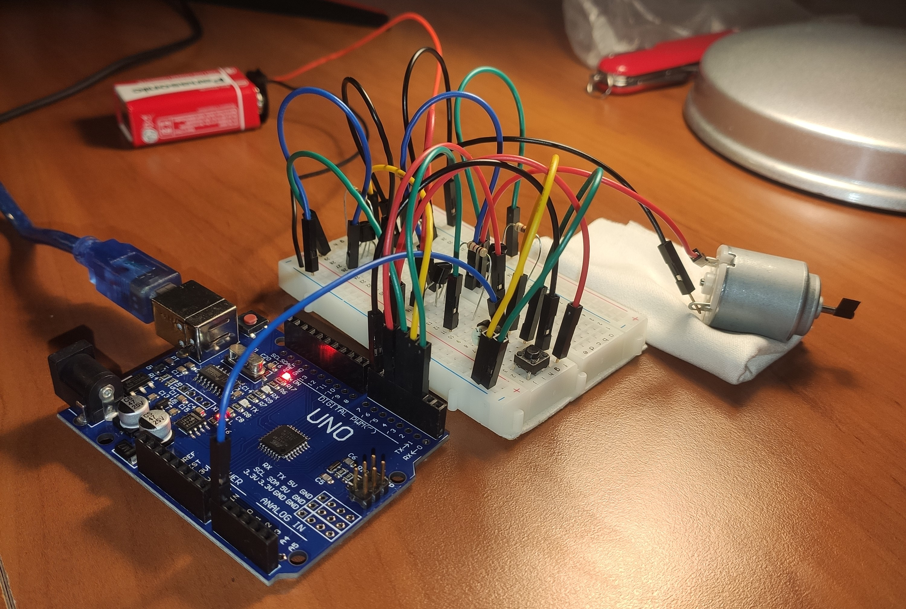

Dokumentacja ogólna

# Hardware





# Projekt układu elektronicznego z wykorzystaniem mikrokontrolera Arduino

## Wprowadzenie

-   Temat projektu:
    Sterowanie silnikiem DC z wykorzystaniem mostka H.

-   Opis: 
    Mostek H zbudowany na tranzystorach bipolarnych 2N2222.
    Sygnały PWM podam na bramki tranzystorów, sterowanie obrotami z potencjometru.
    Diody które pokazałem na schemacie nie zostaną zastosowane. Nie jest to wymagane.

    

-   Lista elementów: 
    Arduino UNO, 
    płytka stykowa, 
    silnik DC 1,5V-3V, 
    źródło zasialania (baterie 9V), 
    4x rezystor 1k, 
    4x tranzystor 2N2222, 
    przycisk, 
    potencjometr, 
    przewody.

Wszystkie wymagane elementy udało już mi się zakupić.

## Wykonanie





Fragment kodu:

```cpp
const int potPin = A0;
const int buttonPin = 7;
const int forward1 = 5;
const int forward2 = 4;
const int backward1 = 3;
const int backward2 = 2;
int potValue = 0;
int motorValue = 0;
int buttonState = 0;
boolean a;
void setup()
{
pinMode(buttonPin, INPUT_PULLUP);
pinMode (forward1, OUTPUT);
pinMode (forward2, OUTPUT);
pinMode (backward1, OUTPUT);
pinMode (backward2, OUTPUT);
}
void loop()
{
potValue = analogRead(potPin);
motorValue = map(potValue, 0, 1023, 0, 255);
buttonState = digitalRead(buttonPin);
if (buttonState == LOW)
{
a=!a;
}
if(a)
{
analogWrite(backward1, motorValue);
digitalWrite (backward2, HIGH);
digitalWrite (forward1, LOW);
digitalWrite (forward2, LOW);
}
else
{
analogWrite(forward1, motorValue);
digitalWrite (forward2, HIGH);
digitalWrite (backward1, LOW);
digitalWrite (backward2, LOW);
}
}
```