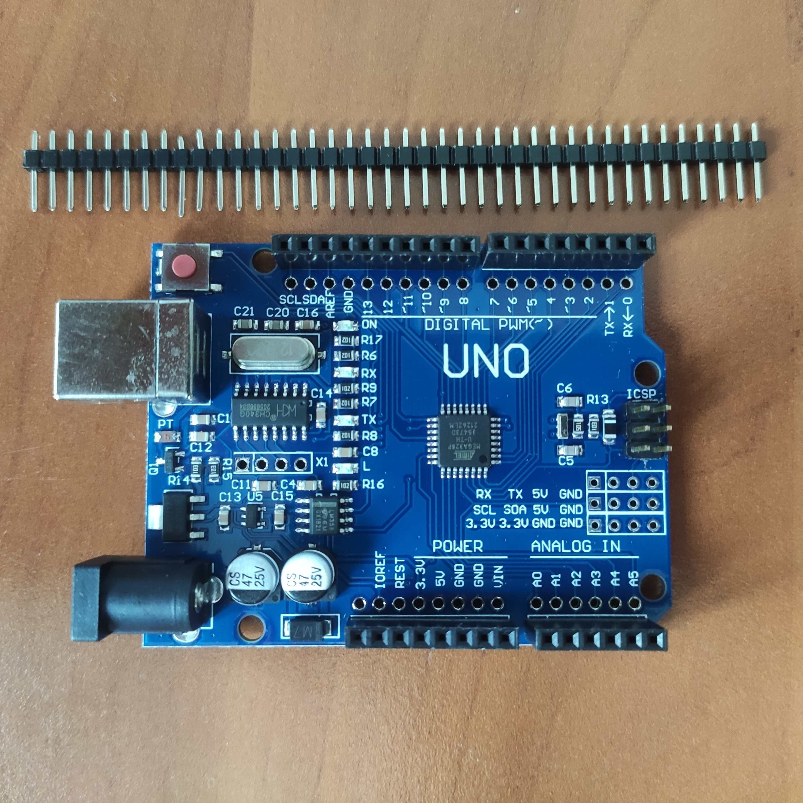
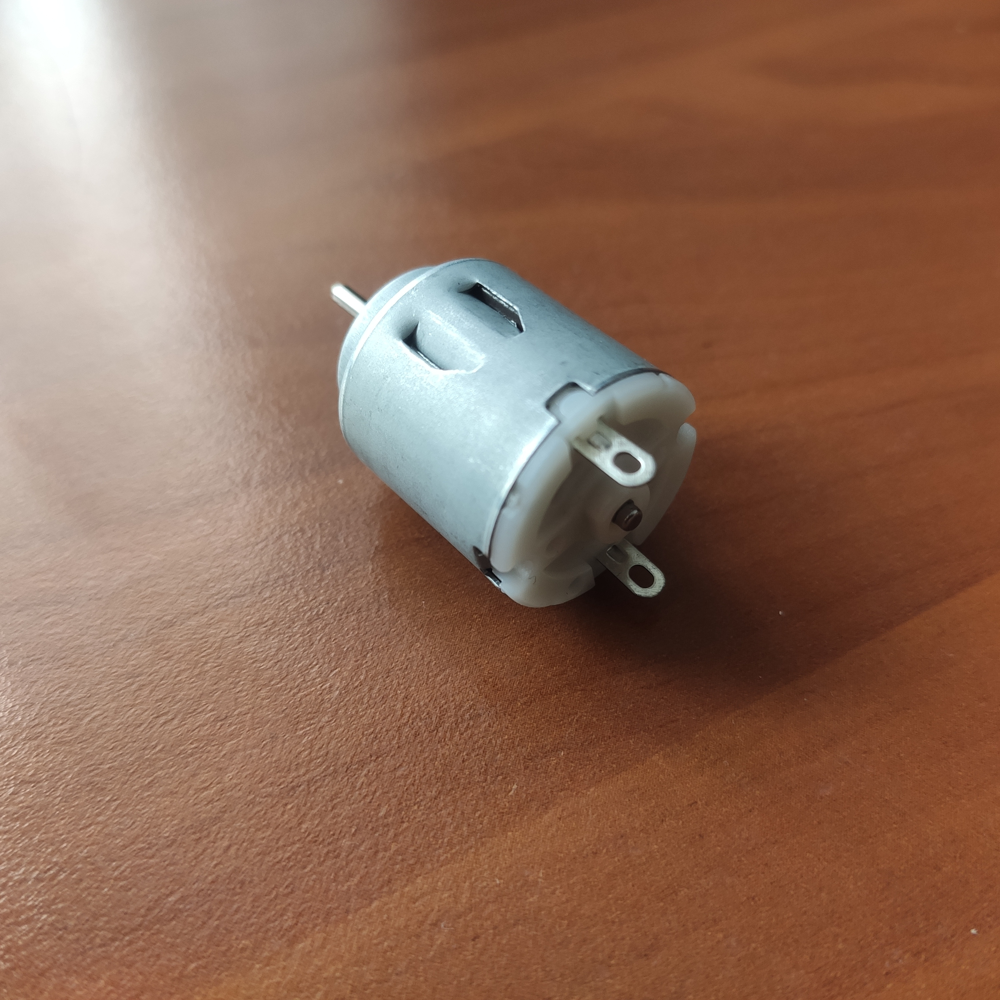
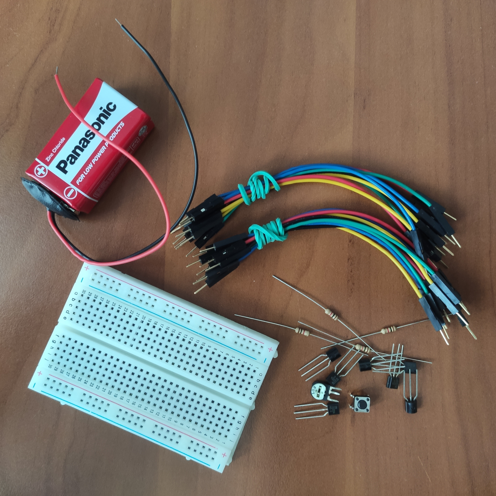

Dokumentacja ogólna.

# hardware






# Projekt układu elektronicznego z wykorzystaniem mikrokontrolera Arduino

## Etap 1

-   Temat projektu:
    Sterowanie silnikiem DC z wykorzystaniem mostka H.

-   Opis: 
    Mostek H zbudowany na tranzystorach bipolarnych 2N2222.
    Sygnały PWM podam na bramki tranzystorów, sterowanie obrotami z potencjometru.

-   Lista elementów:
    Arduino UNO
    płytka stykowa
    silnik DC 1,5V-3V
    źródło zasialania (baterie 9V)
    rezystory 1k
    tranzystory 2N2222
    guzik
    potencjometr
    przewody

Fragment kodu

```cpp
//roboczy
```